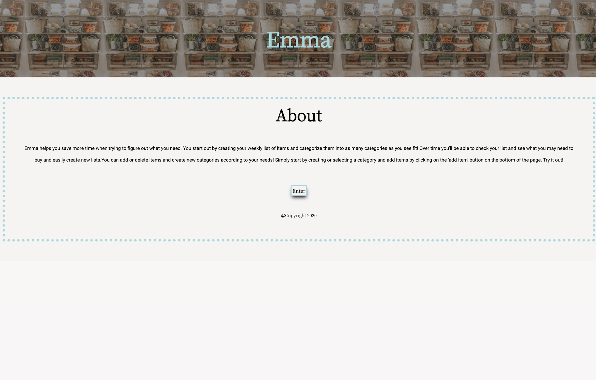
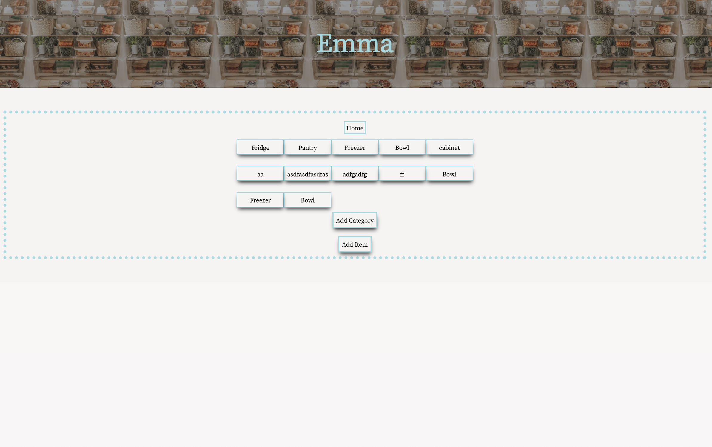
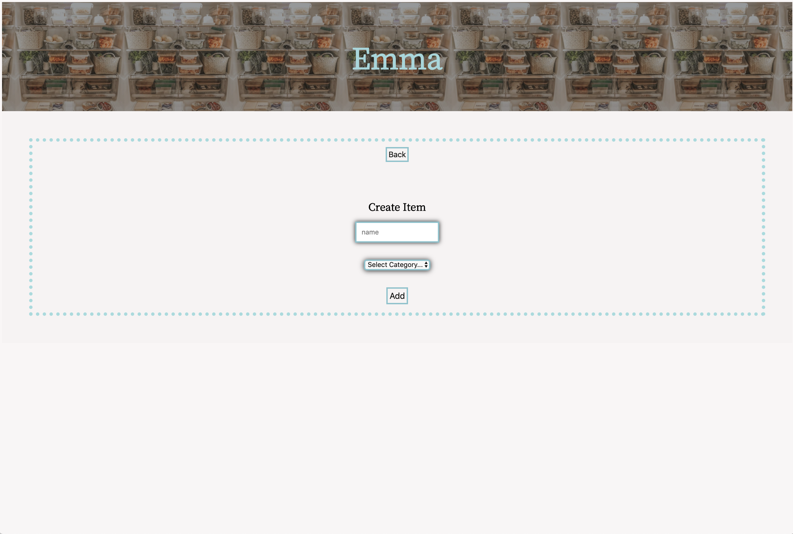
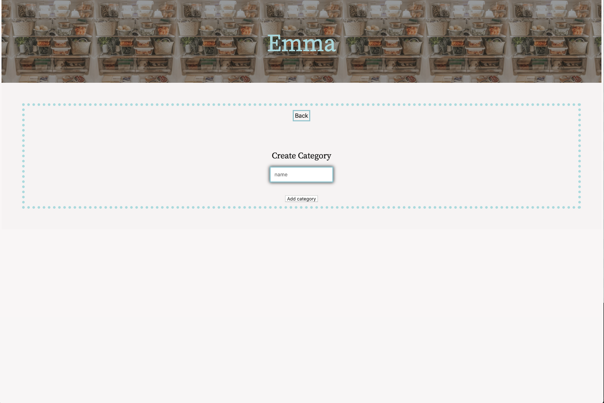

# Emma
#### Created by: Maria Danielson
[Live page](https://mal3905-emma-app.now.sh/)

# Technologies Used

### Client Side:  
React | Javascript | Zeit |  HTML | CSS

### Server Side:
Express.js | Node.js | PostgreSQL | Heroku

# Introduction
 This app allows a user to keep organized with their grocery list of items. The user can add items to the shopping list as well as separate them into different categories. Categories can be chosen through a drop down menu of existing categories. The user can customize their lists according to their needs without any constrictions as to what kind of categories they can make. Items can be deleted and created. The clean styling of the app allows for an easy to use platform and is soft on the eyes. 

# Landing Page

# Dashboard

# Add Items Form

# Add Category Form

[Client](https://github.com/mal3905/Emma-Client.git)
[Server](https://github.com/mal3905/emma-server.git)

Getting Started
Installing
Clone the repository and download dependencies.

$ git clone https://github.com/mal3905/Emma-Client.git
$ cd Group4-Capstone-3
$ npm install
Launching
Start the development server.

$ npm run start

Testing
Run tests
$ npm run test

