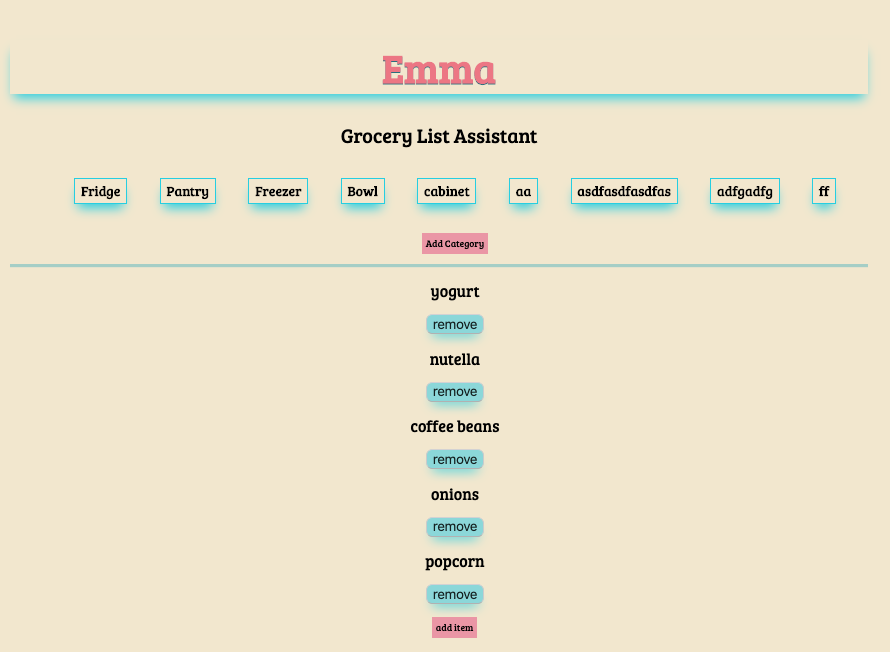
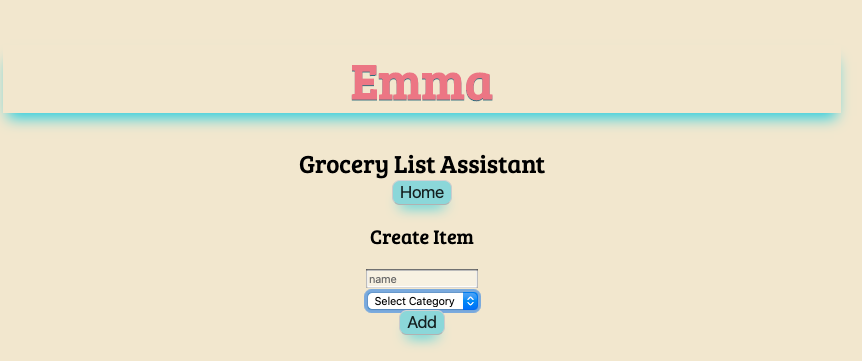
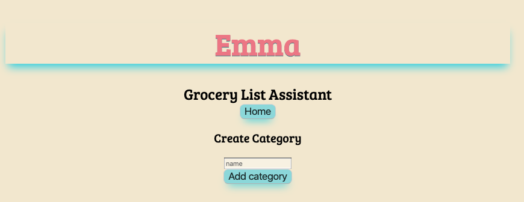

## App Name
 Emma: your grocery list assistant

 # About
 This app allows a person to keep organized with their grocery list of items. The person can add items to the shopping list as well as seperate them into different categories. The user can customize their lists according to their needs without any constrictions as to what kind of categories they can make. Items can be deleted and created. The clean styling of the app allows for an easy to use platform and is soft on the eyes. 

## Live App can be found here !
[emma](https://emma-app-f6xxigitj.now.sh/)

## Technoligies Used
Client side: Reactjs, Javascript, HTML and CSS
Server side: Express.js, Node.js, PostgreSQL

# Links to code 
Client : [clinet](https://github.com/mal3905/Emma-Client2.git)
Server: [server](https://github.com/mal3905/emma-server.git)

# Screen Shots
Home page 

Add Item Page: 

Add Category Page: 

created by : Maria Danielson  2019

